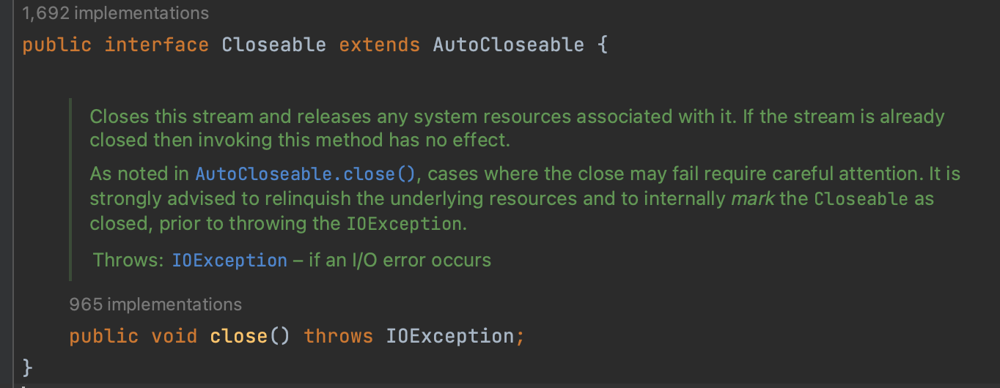

## Use ressources

---

Les ressources Kotlin/JVM stdlib

- FileReader
- java.sql.Connection
- InputStream
- etc.

Notes: Les ressources doivent être gérées et fermée.

---
```Kotlin [1-8|6]
fun countCharInFile(path: String) Int {
	val reader = BufferedReader(FileReader(path))
	try {
		return reader.lineSequence().sumOf { it.length }
	} finally {
		reader.close()
	}
}
```
Notes: Code style Java typique. Verbose et buggy en plus on ne gère pas les exceptions.

---

Elles implémentes le `closable` interface


---

`use` keyword!

Notes: On peut donc utiliser le use keyword pour automatiquement fermer les ressources.

---

```Kotlin [1-6|3]
fun countCharInFile(path: String) Int {
	val reader = BufferedReader(FileReader(path))
	reader.use {
		return reader.lineSequence().sumOf { it.lengh }
	}
}
```

---
```Kotlin [2-4]
fun countCharInFile(path: String) Int {
	BufferedReader(FileReader(path)).use { reader -> 
		return reader.lineSequence().sumOf { it.lengh }
	}
}
```
Notes: Le receiver est passé en argument, on peut simplifier!

---
```Kotlin [2-4]
fun countCharInFile(path: String) Int {
    File(path).useLines { lines ->
        return lines.sumOf { it.lenght }
    }
}
```
Notes: On peut utiliser File de la stdlib avec la fonction useLines qui supporte notre cas.

---

```Kotlin [1-5|1]
fun countCharInFile(path: String) Result<Int> = RunCatching {
	File(path).useLines { lines ->
        lines.sumOf { it.length }
    }
}
```
Notes: On peut rendre notre code plus sécuritaire avec le Result type.
Le caller devra gérer le résultat de la fonction.

---

Exemple d'usage

```Kotlin
countCharInFileException("file.txt")
	.onSuccess { println("Char count: $it") }
	.onFailure { println(it.message) }
```

---
### Reference

- `Effective Kotlin` par Marcin Moskala
- Kotlin Idoms: [kotlinlang.org/docs/idioms.html](https://kotlinlang.org/docs/idioms.html#java-7-s-try-with-resources)

---

## Thank you

- @vinsg
- Website: [vinsg.ca](https://vinsg.ca)
- Presentation: [Source]()


